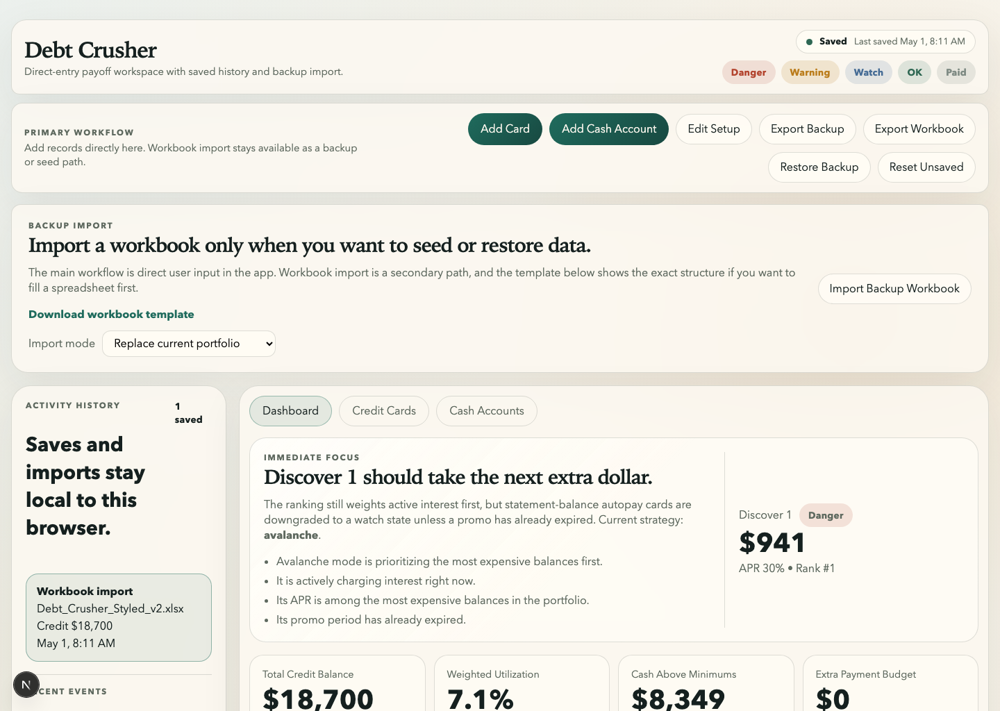
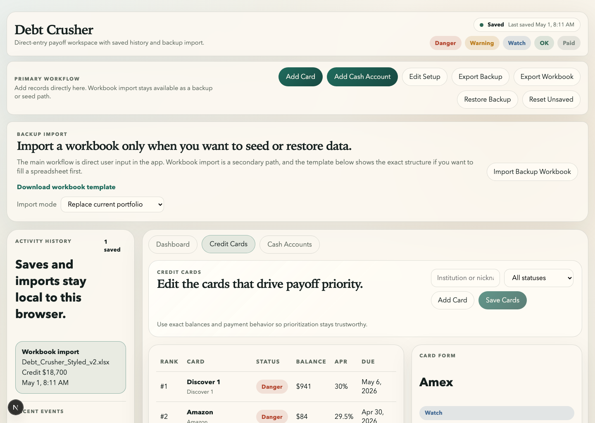
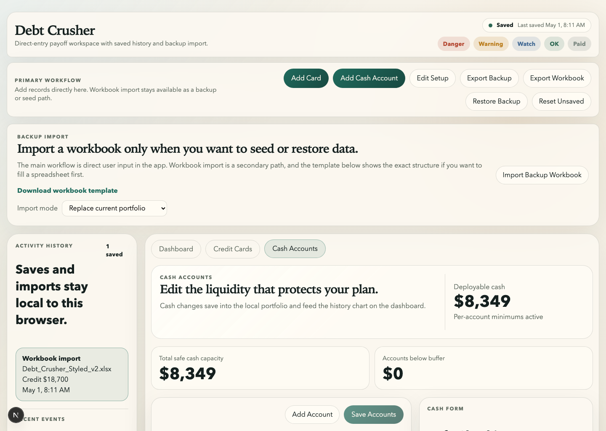

# Debt Crusher

Debt Crusher is a forms-first finance workspace for managing credit cards, cash accounts, payoff priorities, and progress history. The app treats direct user input as the primary workflow and keeps spreadsheet import/export and screenshot OCR import as secondary convenience paths.

## Why this exists

Most debt tools either feel like bookkeeping spreadsheets or hide their decision logic behind generic advice. Debt Crusher is designed to be a practical decision console:

- enter and maintain your real account state directly in the app
- understand which card needs attention next and why
- compare payoff strategies
- track change over time through saved history

## What the app does

- manages credit cards, cash accounts, and setup values in a forms-first UI
- stores data locally with Prisma and SQLite for development
- computes dashboard metrics such as total balance, utilization, cash above minimums, and top payoff target
- explains the top recommendation rather than only giving a raw rank
- supports payoff strategy modes such as avalanche, snowball, promo-first, and custom weighting
- keeps snapshot history, trend views, and event-style save history
- supports workbook import/export plus JSON backup export/restore
- supports screenshot OCR import with review-before-save and stored source images

## Product shape

Main views:

- `Dashboard`
  - payoff focus, warnings, summary metrics, and history trends
- `Credit Cards`
  - card list, detail form, ranking, and status context
- `Cash Accounts`
  - account list, safe cash calculations, and account editing

## Screenshots





## Tech stack

- Next.js
- React
- TypeScript
- Prisma
- SQLite
- Tesseract.js

## Local setup

```bash
cp .env.example .env
npm install
npm run prisma:generate
npm run db:push
npm run dev
```

Open:

```text
http://localhost:3000
```

## Important workflow note

Debt Crusher does **not** autosave every keystroke.

- form edits update the local draft immediately
- the app shows unsaved state
- persistence happens only when the user explicitly saves

That behavior is intentional so the app remains decision-oriented and predictable.

## Screenshot import flow

This repo now supports a screenshot-first intake path intended for iPhone use:

1. open a banking app on your phone
2. take a screenshot manually
3. upload that screenshot into Debt Crusher
4. review the OCR result
5. save it as a replace or merge import

Current scope:

- OCR runs locally inside the app with `tesseract.js`
- the import is always review-first; it does not autosave
- the original screenshot is stored with the saved snapshot for recheck later
- this is a web-app import flow, not yet a native iPhone Share Sheet target

## Key docs

- `Plan.md` - product roadmap and current build status
- `USER_GUIDE.md` - operator walkthrough and save behavior
- `graphify-out/repo-semantic-summary.md` - low-token repo summary for LLMs

## Current status

Implemented:

- forms-first CRUD flow for cards, cash accounts, and settings
- explainable recommendation engine baseline
- history snapshots and trend charts
- searchable institution picker
- workbook import/export and JSON backup restore/export
- screenshot OCR import, review-before-save flow, and saved screenshot artifacts

Still planned:

- native iPhone wrapper / real Share Sheet target if we want direct iOS intake
- richer recommendation logic
- stronger historical comparison views
- more explicit event-level tracking
- better notification polish
- optional hosted persistence migration later

## Resume value

This repo shows:

- product thinking around financial decision support
- practical data modeling and persistence
- explainable recommendation UX
- explicit save-state design instead of hidden autosave
- local-first app architecture with migration headroom

## Start here

1. Read `Plan.md`
2. Read `USER_GUIDE.md`
3. Open `components/debt-crusher-app.tsx`
4. Read `graphify-out/repo-semantic-summary.md`

## License

This repository is proprietary and released under [All Rights Reserved](LICENSE).
